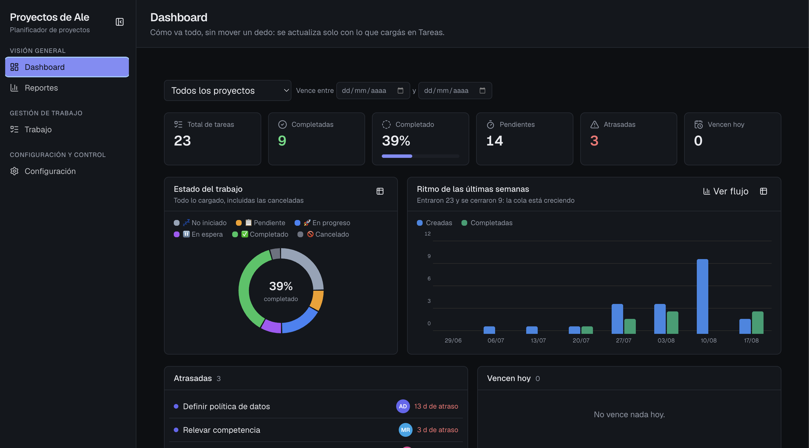

# Apex — Planificador de proyectos

Aplicación web local para planificar proyectos: tareas, Kanban, Gantt,
calendarios y matriz de Eisenhower. Corre en tu máquina, guarda todo en un
archivo SQLite, no necesita internet ni cuenta de nada.



## Probarla

🔗 **[apex.estudiosynapsis.com](https://apex.estudiosynapsis.com)** — usuario `demo`, contraseña `demo.123`

Es una instancia de demostración con datos de ejemplo: entrá y tocá lo que
quieras. Arrastrá una barra del Gantt, mové una tarjeta de columna en el
Kanban, cambiá un cuadrante en la matriz.

Se restaura sola todas las noches desde una copia limpia, así que ningún
desorden sobrevive hasta el día siguiente — ni el tuyo ni el de nadie.

## De dónde salió

Antes de Apex había una planilla de Google Sheets. Se usaba para seguir el
estado de los proyectos y funcionaba: cada fila una tarea, columnas de
responsable y fecha, fórmulas para los días restantes, y un tablero armado a
fuerza de `COUNTIFS`.

Funcionaba hasta que dejó de hacerlo. Las fórmulas cubrían un rango fijo, así
que había un tope invisible de proyectos. Cambiar el nombre de una fase
obligaba a corregirla fila por fila. Los porcentajes de avance se hundían
porque las tareas canceladas seguían contando en el denominador. Y no había
forma de saber quién había cambiado qué, ni cuándo.

Ninguno de esos problemas era de la planilla: eran del formato. Una hoja de
cálculo no tiene entidades ni relaciones, así que toda estructura hay que
simularla con texto repetido y rangos, y esa simulación se rompe al crecer.

Apex tomó esa planilla como especificación —qué había que medir, qué preguntas
se hacían todas las semanas— y la reconstruyó sobre una base de datos real:
las listas sueltas pasaron a ser tablas, la fase pasó a ser una entidad con
orden propio, las fórmulas se volvieron funciones puras con tests, y cada
cambio quedó registrado. Los topes desaparecieron porque dejaron de existir
las razones para tenerlos.

Lo que quedó es un producto propio con arrastre real en tablero y cronograma,
subtareas, dependencias, comentarios, adjuntos e historial. Los mismos datos
se miran desde ocho ángulos distintos, sin volver a cargarlos.

Y algo de la planilla sobrevive a propósito: **Configuración → Datos** exporta
todo a XLSX con los derivados ya calculados. Si mañana querés volver a una
hoja de cálculo, podés.

## Cómo levantarla

```bash
npm install
npm run dev
```

Abre en <http://localhost:3000>. La primera vez crea `data/apex.db`, corre
las migraciones y siembra los catálogos por defecto (estados, etapas Kanban y
prioridades) — no hay que hacer nada más.

Empezá por **Configuración → Proyectos**: toda tarea vive dentro de un
proyecto.

## Las pantallas

| Pantalla | Qué hace |
| --- | --- |
| **Dashboard** | KPIs (total, completadas, %, pendientes, atrasadas, vencen hoy), dona de estado, ritmo semanal, tabla de proyectos y cortes por estado, prioridad, etapa y responsable. Cada número lleva a Tareas con ese filtro; cada corte, a su reporte |
| **Reportes** | Cuatro vistas: entrega y demoras, equipo, flujo y etapas, distribución. Responde quién demora, qué etapa frena el trabajo y si se llega a las fechas |
| **Tareas** | La hoja central. Tabla densa con edición inline, agrupación, subtareas colapsables, filtros combinables y acciones masivas. El panel lateral abre el detalle completo |
| **Tablero Kanban** | Columnas configurables, arrastre real entre ellas, límite de trabajo en curso, orden manual o automático |
| **Matriz de Eisenhower** | Cuatro cuadrantes por importancia y urgencia. Arrastrar una tarjeta cambia esos dos valores |
| **Diagrama de Gantt** | SVG propio: barras arrastrables y redimensionables, líneas de dependencia, hoy, fines de semana y festivos marcados |
| **Calendario mensual** | Las tareas en su fecha límite, mes a mes |
| **Calendario semanal** | La carga real de cada día, con barras multi-día |
| **Configuración** | Proyectos, fases, responsables, estados, etapas, prioridades, calendario laboral y exportación |

## Atajos de teclado

`d` Dashboard · `r` Reportes · `t` Tareas · `k` Kanban · `m` Matriz · `g` Gantt ·
`c` Calendario mensual · `s` Calendario semanal · `,` Configuración ·
`?` ayuda · `Esc` cerrar cualquier panel.

La barra lateral se comprime a solo íconos con el botón de su esquina; la
preferencia queda guardada.

## En el celular

La app está pensada mobile first y se usa desde el teléfono en la misma red:
abrí `http://<ip-de-tu-mac>:3000` (el comando `npm run dev` la imprime como
*Network*). Se puede agregar a la pantalla de inicio: abre a pantalla
completa, con su ícono y sin la barra del navegador.

Ahí la navegación es un cajón que se abre con el botón de arriba a la
izquierda, las tareas se ven como tarjetas en vez de tabla, el detalle ocupa
toda la pantalla y los filtros se pliegan tras un botón. Kanban, Gantt y el
calendario semanal se desplazan de costado; el Gantt abre centrado en hoy.

Las capas que se posicionan contra la ventana —el panel de detalle, el cajón
de navegación, los modales— reponen el resguardo del notch y de la barra de
gestos con las variables `--safe-*` de `globals.css`. Sin eso, el botón de
cerrar queda debajo del reloj y la batería.

> Para que la red local funcione, `next.config.ts` habilita los rangos de IP
> privados en `allowedDevOrigins`. Sin esa lista, el servidor de desarrollo
> responde **403 a sus propios archivos JavaScript** cuando el pedido no viene
> de `localhost`: la página se ve, pero no se hidrata y ningún botón responde.

## Comandos

```bash
npm run dev          # servidor de desarrollo
npm run build        # build de producción
npm test             # tests de la lógica derivada
npm run lint         # eslint

npm run db:generate  # generar migración tras cambiar el schema
npm run db:migrate   # aplicar migraciones
npm run db:seed      # sembrar los catálogos por defecto (idempotente)

npm run demo:seed    # cargar datos de ejemplo para probar las vistas
npm run demo:clear   # borrar los datos de ejemplo
npm run verify:e2e   # correr las mutaciones reales y contrastarlas con SQL
```

> `demo:seed` **borra todos los proyectos, tareas y personas** antes de cargar
> el ejemplo. Es para probar, no para usar sobre datos reales.

## Dónde están tus datos

Todo vive en la carpeta `data/`:

- `data/apex.db` — la base entera
- `data/uploads/` — los archivos adjuntos

Copiar esa carpeta es un respaldo completo. Además, **Configuración → Datos**
exporta a XLSX (una hoja por entidad, con los días restantes y laborables ya
calculados) y a JSON.

La ruta se puede mover con la variable `APEX_DB_PATH`, que es lo que usa la
imagen de Docker para apuntar al volumen.

## Desplegarla

Hay un `Dockerfile` de tres etapas: instala, compila y entrega solo lo
compilado, con un usuario sin privilegios y un chequeo de salud.

```bash
docker build -t apex .
docker run -d -p 3000:3000 -v apex-data:/app/data apex
```

El único punto que hay que persistir es **`/app/data`**: ahí viven la base y
los adjuntos. Sin ese volumen, cada despliegue empieza de cero.

Dos detalles del `Dockerfile` que no son obvios y conviene no deshacer: fija
la versión de npm (la imagen base trae una anterior que rechaza el archivo de
bloqueo) e instala `python3`, `make` y `g++` en la etapa de dependencias
(`better-sqlite3` se compila desde el código fuente). Las herramientas quedan
encerradas ahí y no viajan a la imagen final.

## Cómo está armado

- **Next.js 16** (App Router) + React 19 + TypeScript + Tailwind 4
- **SQLite** vía `better-sqlite3` + **Drizzle ORM**
- **dnd-kit** para el arrastre, **@tanstack/react-virtual** para la tabla
- Server Actions para todas las mutaciones

Toda la lógica derivada —días restantes, atrasos, cuadrante de Eisenhower,
días laborables con festivos, rollup de subtareas— vive en un único lugar,
`src/lib/derive.ts`. La analítica de proyecto —lead time, cycle time, tiempo
por etapa, puntualidad, aging, throughput— vive en `src/lib/analytics.ts`.
Ambos son funciones puras con tests (`*.test.ts`); las vistas las consumen y
ninguna las reimplementa.

Los gráficos son propios (`src/components/charts/`), sin librería externa. La
paleta está validada para daltonismo y contraste en modo claro y oscuro; cada
tarjeta trae su vista de tabla, así ningún valor depende del color ni del
hover.

Más detalle en [`docs/modelo-datos.md`](docs/modelo-datos.md),
[`docs/metricas.md`](docs/metricas.md) y
[`docs/casuistica.md`](docs/casuistica.md).
